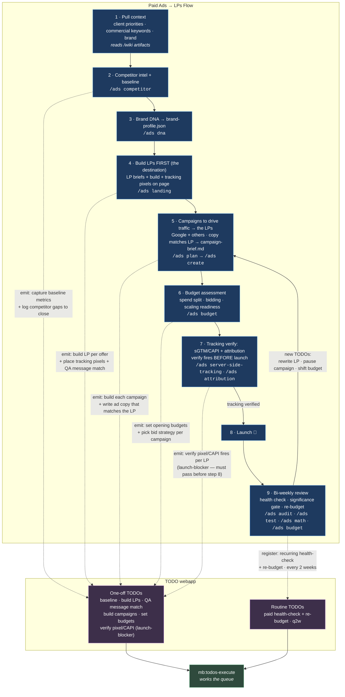

# Paid Ads → LPs Flow

The **flow** is the orchestration engine. The **`/todos` store** is a separate, durable, client-shareable execution ledger: each flow step _writes/updates_ TODOs, and `mb:todos-execute` works that queue. The bi-weekly review re-feeds the build steps — closing the loop.

## Why LPs first

The LP is the destination — build it before the traffic sources so the campaigns are pointed at something real, and so **ad copy is written to match the LP** (not the reverse). Tracking pixels go on the page at build time (step 4); they're _verified_ before launch (step 7). Once campaigns exist, `/ads budget` (step 6) sizes the spend split, bidding, and scaling readiness.

## TODOs: how they are generated and handled

The flow never executes work directly — it **emits TODOs** into the store, and a separate pass executes them. Two kinds:

### One-off TODOs

- **What they are:** the build-out work that happens once to stand the campaigns up — capture baseline, build each LP, QA message match, build each campaign, set opening budgets, verify pixel/CAPI.
- **How they're generated:** emitted by the build steps as the flow runs (steps 2, 4, 5, 6, 7). Each step writes its own tasks — e.g. step 4 emits one "build LP" + one "QA message match" per offer, so the list scales with the number of LPs/campaigns, not the number of steps.
- **How they're handled:** worked off the queue by `mb:todos-execute` and marked done as each completes. One is a **launch-blocker** — "verify pixel/CAPI fires per LP" (step 7) must pass before step 8 (Launch). Once the build-out is done, these clear out; they don't recur.

### Routine TODOs

- **What they are:** the standing, recurring obligation — the bi-weekly health-check + re-budget. These don't get "finished"; they fire on a cadence for as long as the campaigns run.
- **How they're generated:** registered once by step 9 via `mb:todos-routine` (the cadence engine), then regenerated automatically every 2 weeks.
- **How they're handled:** each cycle, `mb:todos-execute` runs the review (`/ads audit` · `/ads test` · `/ads math` · `/ads budget`). The review's findings are written back as **new one-off TODOs** (rewrite that LP, pause a campaign, shift budget) — which is how the routine feeds [the loop](#the-loop). Routine TODOs are the most client-shareable: a recurring, predictable report cadence the client can watch in the webapp.

## Artifacts

Working files live under `/wiki/paid/` so they sit with the rest of the client's brain and the TODO store can reference stable paths:

- `brand-profile.json` (step 3)
- LP briefs (step 4)
- `campaign-brief.md` (step 5)

## The loop

Step 9's review is the engine of iteration: it writes _new_ TODOs (rewrite that LP, pause a campaign, shift budget) back into the store and re-enters the campaign + budget steps (5–6). The flow runs; the TODO store remembers.
