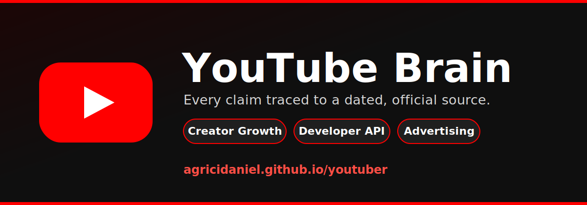

# YouTube Brain

<p align="center">
  
</p>

<p align="center">
  <a href="https://agricidaniel.github.io/youtuber"></a>
  
  
  
  
</p>

A **source-cited operating brain for YouTube** — every recommendation traces to a
dated official or primary source. It is an Obsidian vault plus an agent skill
layer, spanning three pillars:

- **Creator growth & strategy** — the recommendation system & discovery,
  subscriptions & audience, retention/AVD, packaging (titles, thumbnails, CTR),
  Shorts vs long-form, publishing cadence, monetization (YPP, memberships,
  Supers, Shopping), analytics, policy, and community.
- **Developer API** — building tools on the Data, Analytics, Reporting, and Live
  Streaming APIs: quotas, OAuth, subscriptions, members, and push notifications.
- **Advertising** — paid campaigns through Google Ads: Demand Gen, formats,
  bidding, targeting, brand suitability, Masthead, and measurement.

**Live docs:** https://agricidaniel.github.io/youtuber — the browsable site, built
from `wiki/` with Quartz.

> Unofficial, community-built. Not affiliated with, sponsored by, or endorsed by
> YouTube or Google LLC. "YouTube" and the YouTube play-button are trademarks of
> Google LLC.

## What's inside

- **67 source-cited notes** across the three pillars, every claim tied to a dated
  official or primary source in `references/source-ledger.json` (156 sources).
- **Domain adapters** that turn a YouTube Studio export into a sourced
  channel-health scorecard, packaging audit, and optimization roadmap.
- **A browsable docs site** (`site/`, Quartz) published to GitHub Pages.
- **A distributable vault** (`assets/template-brain/`) and an agent skill layer
  (`SKILL.md` + `scripts/`) installable into multiple agent runtimes.
- **Deterministic demo, tests, and release packaging** that scans for secrets,
  local paths, and unsafe archive entries.

## Buyer

YouTube creators, channel managers, editors, and content strategists who need
repeatable, source-cited decisions on what to make, how to package it, and how to
grow and monetize a channel — plus tool builders and advertisers working the API
and paid surfaces.

## Outputs

- Channel health scorecard (growth rate, AVD, CTR, RPM)
- Content performance analysis (top and bottom decile by watch time, CTR, subscriber attraction)
- Packaging audit (titles, thumbnails, click-through rate)
- Monetization audit (RPM opportunity, YouTube Partner Program gaps)
- Monthly optimization roadmap (A/B test plan and publishing cadence)

## Quick start

```bash
python -m pip install -e .
youtube-brain demo
youtube-brain lint --vault examples/sample-vault
youtube-brain report --vault examples/sample-vault --html-only
```

Create a vault for your own channel:

```bash
youtube-brain new acme --client-name "Acme Co" --owner "Your Name" --out-dir ~/youtube-brain-vaults
youtube-brain ingest --vault ~/youtube-brain-vaults/acme --file tests/fixtures/sample-source.md
youtube-brain synthesize --vault ~/youtube-brain-vaults/acme
youtube-brain report --vault ~/youtube-brain-vaults/acme --html-only
youtube-brain next --vault ~/youtube-brain-vaults/acme
```

Or browse it as an Obsidian vault: open this folder and start at
`wiki/YouTube Brain Home.md`.

## Boundaries

V1 is advisory and read-only. It does not mutate accounts, systems, books,
pipelines, publishing tools, customer records, or live production data.

Domain claims are release-blocked until `references/current-requirements.md`,
`references/market-research.md`, `references/source-map.md`, and
`references/source-ledger.json` contain dated source material from trustworthy
sources.

## Maturity gates

1. Scaffolded: product shell, vault, source pack, scripts, tests, and demo exist.
2. Researched: dated trustworthy sources replace placeholder research.
3. Domain-adapted: real domain importer, synthesis, reports, fixtures, and tests exist.
4. Demo-verified: sample vault regenerates deterministically and reports cite sources.
5. Market-ready: audit score is at least 90 with no critical failures.

Scores are capped by maturity. A scaffold cannot become market-ready by edited
markdown alone. This repo is **market-ready** — run
`python scripts/audit_brain.py --require market-ready` to confirm.

## Research policy

Use official, primary, or vendor documentation first. Use market or practitioner
sources only as supporting evidence. Do not treat blog roundups or AI summaries
as primary truth. Record evidence in `references/source-ledger.json`; prose-only
research notes do not satisfy the gate.

## Release

```bash
python scripts/package_release.py --version 0.1.0
python scripts/package_release.py --version 1.0.0 --release-type market-ready
```

Release packaging scans for secrets, local paths, symlinks, untracked drift, and
unsafe ZIP entries before writing `dist/RELEASE_MANIFEST.json` and
`dist/SHA256SUMS`. Market-ready packaging also runs `scripts/audit_brain.py`.

## License

Licensed under the [Apache License 2.0](LICENSE). Quotations from third-party
documentation remain the property of their owners; see
[`THIRD_PARTY_NOTICES.md`](THIRD_PARTY_NOTICES.md). See also
[`CONTRIBUTING.md`](CONTRIBUTING.md) and [`SECURITY.md`](SECURITY.md).

## Community

Built and maintained inside the AI Marketing Hub Pro community. Join, ask
questions, and get the latest YouTube creator-growth playbooks at
https://www.skool.com/ai-marketing-hub-pro
