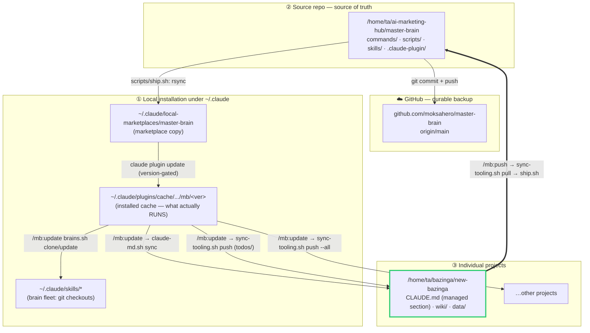

# Master Brain sync architecture

Three-node setup and the propagation paths between them.

- **① Local installation** under `~/.claude` — what actually runs.
- **② Source repo** at `/home/ta/ai-marketing-hub/master-brain` — source of truth, pushed to GitHub.
- **③ Individual projects** like `/home/ta/bazinga/new-bazinga` — where work happens; changes must flow back to ②.



## The loop (now closed)

You edit reusable `todos/` tooling in a project (③). `/mb:push` promotes ONLY the
shared tooling up into the source repo (②) and ships it (version bump + GitHub
push + propagate to the local cache). Every other project then receives it on its
next `/mb:update` (or all at once via `sync-tooling.sh push --all`).

What flows in each direction:

| Asset | Direction | Mechanism |
| --- | --- | --- |
| `todos/` dashboard + scripts + migrations + schema | ③ → ② → all ③ | `/mb:push` up, `/mb:update` down |
| Persistence rule (managed `CLAUDE.md` block) | ② → all ③ | `claude-md.sh` (canonical text lives in the script) |
| Brain fleet | ② → `~/.claude/skills` | `brains.sh` |

What deliberately **stays put** (never crosses ③ → ②):

- Project DATA — `wiki/`, `data/`, `reports/`, the SQLite todo db.
- Project-OWNED tooling — `routines.yml` (cadence), `wrangler.jsonc` (worker name),
  `mds/` seed todos. These are seeded once on init, then never overwritten.
- `web/` — that's the project's own site, not master-brain tooling.

Registry of projects to fan out to: `~/.claude/master-brain-projects.txt`
(machine-local; `/mb:init` registers each new project).
```
